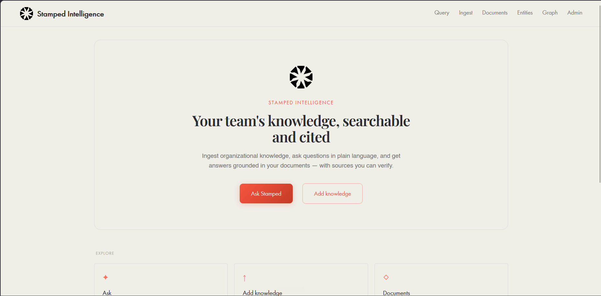
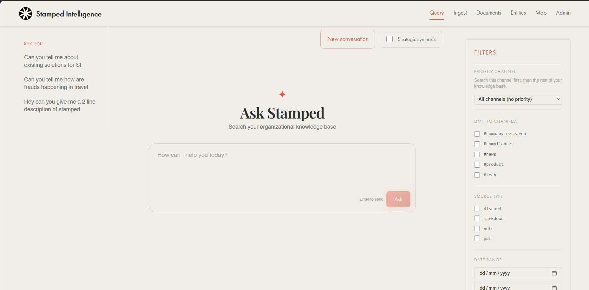
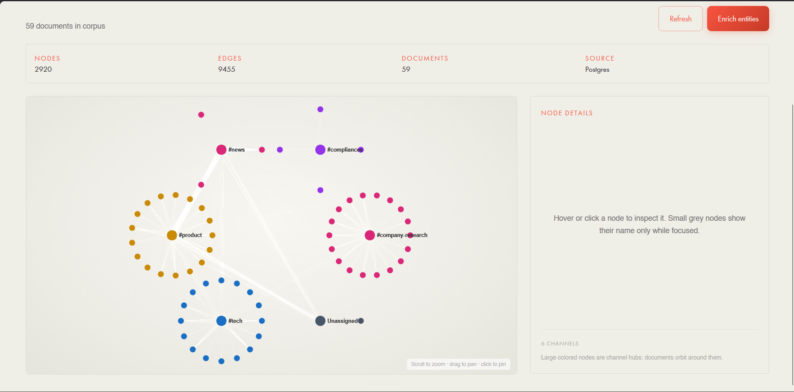

# Stamped Intelligence System

Internal AI-powered knowledge platform for the Stamped team: ingest organizational content, ask questions in plain language, and get answers with verifiable citations.

## Screenshots

### Home

Landing page with quick paths into query, ingest, and the rest of the corpus tools.



### Query

Channel-aware search with filters, conversation history, and cited answers.



### Knowledge map

Live graph of documents, Discord channels, and extracted entities (Sigma.js, backed by Postgres).



---

## Stack

| Layer | Technology |
|-------|------------|
| **Web** | Next.js 14 App Router, Tailwind |
| **API** | Express + TypeScript |
| **Database** | PostgreSQL (Supabase) via Prisma |
| **Vectors** | Qdrant |
| **AI** | OpenAI embeddings + chat |
| **Bot** (optional) | Discord.js ingest worker |

> **Knowledge map** is built live from Postgres — no Python or Graphify required in production. Optional [Graphify](https://pypi.org/project/graphifyy/) in Cursor can be used locally for deeper corpus exploration (`graphify-out/` is gitignored).

---

## Prerequisites

- Node.js 20+
- pnpm 9+ (or `npx pnpm@9.15.0` if pnpm is not on PATH)
- Docker Desktop (for local Qdrant)
- OpenAI API key
- Supabase project (or local Postgres via Docker)

---

## How to run (local development)

### 1. Environment

Copy the example file and configure secrets in **`.env.local`** (gitignored):

```powershell
copy .env.example .env.local
```

**Required:**

| Variable | Purpose |
|----------|---------|
| `OPENAI_API_KEY` | Embeddings + chat |
| `DATABASE_URL` | Supabase pooled URL (port 6543, `?pgbouncer=true`) |
| `DIRECT_URL` | Supabase direct URL (port 5432) for migrations |
| `QDRANT_URL` | Cluster URL from [Qdrant Cloud](https://cloud.qdrant.io) (e.g. `https://….cloud.qdrant.io:6333`) |
| `QDRANT_API_KEY` | API key from the cluster dashboard |
| `QDRANT_COLLECTION` | `stamped_chunks` (created on API startup if missing) |
| `NEXT_PUBLIC_API_URL` | `http://localhost:8000` |

**Optional:**

| Variable | Purpose |
|----------|---------|
| `INGEST_BATCH_ROOTS` | Comma-separated folders allowed for batch ingest |
| `API_SECRET_KEY` | Shared secret for **ingest** API routes |
| `NEXT_PUBLIC_API_SECRET_KEY` | **Same value** as `API_SECRET_KEY` (web UI sends this on ingest requests) |

### 2. Install dependencies

```powershell
cd D:\Startups\Stamped\Intelligence-Layer
npx pnpm@9.15.0 install
npx pnpm@9.15.0 db:generate
```

### 3. Database migrations

```powershell
npx pnpm@9.15.0 db:migrate:deploy
```

### 4. Start Qdrant

Start **Docker Desktop**, then:

```powershell
docker compose up qdrant -d
```

Verify: http://localhost:6333/dashboard

### 5. Run API + web (+ optional bot)

```powershell
npx pnpm@9.15.0 dev
```

| Service | URL |
|---------|-----|
| Web UI | http://localhost:3000 |
| API | http://localhost:8000 |
| API health | http://localhost:8000/api/v1/admin/health |

---

## Using the app

| Page | URL | What it does |
|------|-----|----------------|
| **Home** | `/` | Overview and shortcuts |
| **Query** | `/query` | Ask Stamped — RAG answers with sources, filters, and threads |
| **Ingest** | `/ingest` | Paste text, upload files, Discord JSON, or batch folder scan |
| **Documents** | `/documents` | Browse, filter, open, and delete ingested material |
| **Entities** | `/entities` | Insurers, products, regulations, and other extracted concepts |
| **Map** | `/graph` | Knowledge map — channels, documents, and entity relationships |
| **Admin** | `/admin` | Postgres, Qdrant, OpenAI, and corpus health |

After bulk ingest, open **Map** and run **Enrich entities** to populate entity nodes on the graph.

### Graphify (optional — Cursor / local only)

For deeper semantic exploration, export corpus markdown under `data/corpus/` and run in Cursor:

```text
/graphify data/corpus
```

Requires Python 3.10+ and `pip install graphifyy`. Not used by the deployed API.

---

## Deployment (overview)

The app is split into services — do not run Qdrant or the API on Vercel.

| Component | Suggested host |
|-----------|----------------|
| `apps/web` | Vercel (`NEXT_PUBLIC_API_URL` → public API URL) |
| `apps/api` | Railway, Render, Fly.io, or a VPS (Node container) |
| Postgres | Supabase |
| Qdrant | [Qdrant Cloud](https://cloud.qdrant.io) (`QDRANT_URL` + `QDRANT_API_KEY`) or local Docker profile |
| `apps/discord-bot` | Same PaaS as the API (always-on worker) |

---

## API endpoints

| Method | Path | Description |
|--------|------|-------------|
| POST | `/api/v1/ingest/text` | Ingest raw text |
| POST | `/api/v1/ingest/file` | Upload `.txt`, `.md`, `.pdf`, `.docx` |
| POST | `/api/v1/ingest/discord` | Discord Chat Exporter JSON |
| POST | `/api/v1/ingest/batch` | Scan folder `{ "folder_path": "..." }` |
| GET | `/api/v1/ingest/jobs` | List ingestion jobs |
| POST | `/api/v1/query` | Natural language query |
| GET | `/api/v1/documents` | List documents (paginated, filterable) |
| GET | `/api/v1/documents/:id` | Document detail + chunks |
| PATCH | `/api/v1/documents/:id` | Update metadata |
| DELETE | `/api/v1/documents/:id` | Delete document + Qdrant vectors |
| GET | `/api/v1/entities` | List entities |
| GET | `/api/v1/entities/:id` | Entity detail |
| GET | `/api/v1/graph/status` | Knowledge map stats |
| GET | `/api/v1/graph/data` | Sigma.js graph payload |
| POST | `/api/v1/graph/rebuild` | Enrich entities (async job) |
| GET | `/api/v1/admin/health` | Service health |
| GET | `/api/v1/admin/stats` | Counts |

---

## Project structure

```
apps/api/              Express API
apps/web/              Next.js UI
apps/discord-bot/      Discord ingest bot (poll + slash commands)
packages/database/     Prisma schema + migrations
```

### Discord ingest bot

1. Add bot env vars to `.env.local` (see `.env.example`).
2. In [Discord Developer Portal](https://discord.com/developers/applications) → **Bot** → **Privileged Gateway Intents**: enable **Message Content Intent**.
3. Register slash commands:

```powershell
npx pnpm@9.15.0 discord:register
```

4. Run the bot alongside the API:

```powershell
npx pnpm@9.15.0 dev:bot
```

Confirm `[discord-bot] Logged in as …` before using slash commands. In a channel: `/ingest-on`, then poll or backfill as needed.

**Security:** Never commit `DISCORD_BOT_TOKEN`. Rotate immediately if exposed.

---

## Scripts

| Command | Description |
|---------|-------------|
| `pnpm dev` | API + web + bot in parallel |
| `pnpm dev:api` | API only |
| `pnpm dev:web` | Web only |
| `pnpm dev:bot` | Discord bot only |
| `pnpm discord:register` | Register slash commands |
| `pnpm db:generate` | Generate Prisma client |
| `pnpm db:migrate:deploy` | Apply migrations |

---

## Troubleshooting

| Issue | Fix |
|-------|-----|
| Qdrant unhealthy in admin | Check `QDRANT_URL` and `QDRANT_API_KEY` in `.env.local`; cluster must be running in Cloud Console |
| `401` / Qdrant connection errors | Regenerate API key; URL must include `https://` (set automatically if omitted) |
| Search returns nothing after switching to Cloud | Re-index vectors (see below) — vectors live in Qdrant, not Postgres |
| Ingestion jobs: **Invalid or missing API key** | Set `NEXT_PUBLIC_API_SECRET_KEY` in `.env.local` to the **same** value as `API_SECRET_KEY`, then restart `pnpm dev` |
| Local Qdrant only | `docker compose --profile local-qdrant up qdrant -d` and use `QDRANT_HOST`/`QDRANT_PORT` instead of `QDRANT_URL` |

### Re-index vectors into Qdrant (after Cloud migration)

Postgres still has your documents, but a **new** Qdrant cluster has no embeddings. Re-running file ingest often skips as **duplicate** (same content hash). Instead, re-embed from the database:

```powershell
# With API running and API_SECRET_KEY set — use the same key in the header
curl -X POST http://localhost:8000/api/v1/admin/reindex-vectors -H "Authorization: Bearer YOUR_API_SECRET_KEY"
```

Or use the same `Authorization: Bearer …` header as in `.env.local` (`API_SECRET_KEY`). This re-embeds every chunk and upserts to Qdrant (OpenAI usage applies).

**Alternative:** delete documents in the UI and batch-ingest source files again from **Ingest → Batch**.
| Prisma migrate fails | Use `DIRECT_URL` on port 5432 (not the pooler port) |
| No chunks after ingest | Content must be long enough for chunks ≥100 tokens |
| Batch path rejected | Add folder to `INGEST_BATCH_ROOTS` and restart the API |
| Map shows only channels | Run **Enrich entities** on the Map page after ingest |
